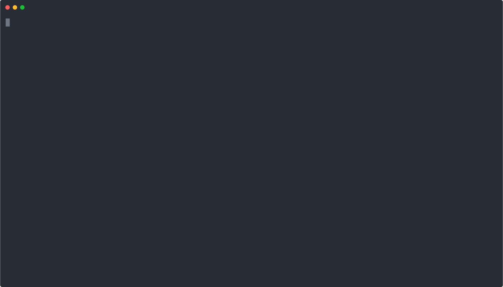

# ♟️ Delphium – Deep Chess Game Insights with LLMs + Stockfish

**Delphium** is a Python-based chess analysis tool that blends traditional engine evaluation with modern AI summarization. It fetches your recent games from Chess.com, analyzes them with Stockfish, and generates natural language insights using OpenAI. Delphium helps players uncover recurring strategic and tactical patterns across their gameplay.

---

## 🚀 Features

* 🔍 **Automatic PGN fetching** from Chess.com by username
* 🤖 **Stockfish integration** to identify blunders, inaccuracies, and missed tactics
* 🧠 **LLM summarization** that captures global patterns across multiple games
* ✨ **Natural language feedback**: "You tend to overextend knights in the middlegame"
* ⚡ **Batching + caching** to speed up repeated runs
* 🔍 **Prompt-driven summaries** for easy customization

---

## 📸 Example Global Summary

```
## 🎯 Recurring Patterns
Across the analyzed games, a few patterns in your decision-making have emerged:

1. **Queen's Gambit Declined Familiarity**: You frequently play the Queen's Gambit Declined, but struggle with maintaining central control and ensuring solid pawn structures. For example, in multiple instances, premature central pawn breaks lead to weakened structures or tactical vulnerabilities (e.g., Game 3: 22...e5?).

2. **Inactive Queen Usage**: There's a tendency to underutilize your queen, missing opportunities for counterplay. In Game 2, moves like 34...Be6?? highlight missed chances to activate the queen effectively.

3. **Weakening Pawn Structures**:...
```

---

## 📂 Project Structure

```
delphium/
├── analyser/       # Stockfish + LLM summarizer
├── fetch/          # Chess.com PGN retrieval
├── prompts/        # Prompt templates for OpenAI
├── pgns/           # (Optional) local PGNs
├── utils/          # Helper functions
├── data/           # Cached analysis
├── config/         # dotenv settings
├── main.py         # CLI entry point
```

---

## 🛠️ Setup Instructions

### 1. Clone the repo

```bash
git clone https://github.com/mattdelphium/delphium.git
cd delphium
```

### 2. Set up environment

```bash
python3 -m venv .venv
source .venv/bin/activate
pip install -r requirements.txt
cp .env.example .env
```

> ⚠️ You'll need an OpenAI API key:
>
> ```
> OPENAI_API_KEY=your-key-here
> CHESS_USERNAME=your-chesscom-username
> ```
Or just use my username if you like: SpuriousWintermute
### 3. Run the program


```bash
python main.py
```

---

## 🔮 Analyze Your Chess.com Games

Delphium will automatically pull your most recent games from Chess.com and provide a summarized report of your play.

Number of games to fetch can be configured in settings.py: MAX_GAMES_TO_SUMMARIZE

---

## 🖥️ Demo



---

## 📄 License

MIT License — open for learning, forking, and building upon.
If you build on Delphium, please credit the original repository 🙏

---

## 💡 Future Ideas

* [ ] Streamlit UI for uploading PGNs and visualizing summaries
* [ ] Output annotated PGNs with embedded comments
* [ ] Opening classifier for recurring repertoire weaknesses
* [ ] Integration with Lichess and other platforms
* [ ] Improve game analysis to highlight strong moves as well as mistakes
* [ ] Board UI to visualise specific move feedback

---

🏷️ Topics

chess • openai • stockfish • game-analysis • cli-tool • python • pgn • llm • gpt-4 • chesscom

---

## 👋 About

Built by Matthew Sherriff [mattdelphium] (https://github.com/mattdelphium), a Python and chess enthusiast.
Designed to explore how LLMs and traditional chess engines can work together to improve player learning.
